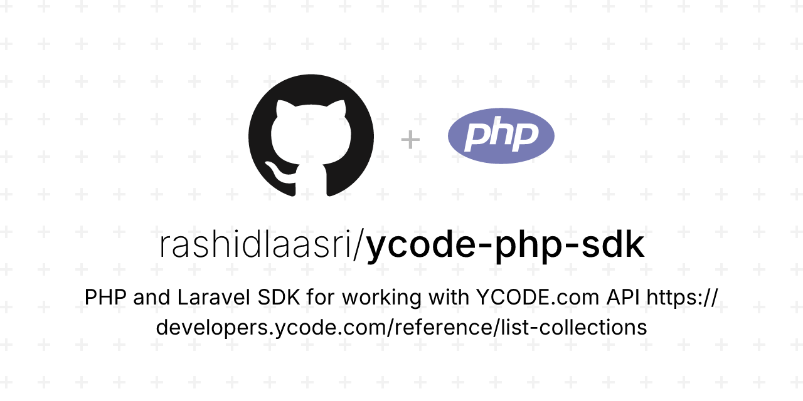

<a href="https://x.com/rashidlaasri">
  <picture>
    <source media="(prefers-color-scheme: dark)" srcset="art/header-dark.png">
    
  </picture>
</a>

# YCODE PHP SDK

<p>
    <a href="https://github.com/rashidlaasri/ycode-php-sdk"></a>
    <a href="https://packagist.org/packages/rachidlaasri/ycode-php-sdk"></a>
    <a href="https://packagist.org/packages/rachidlaasri/ycode-php-sdk"></a>
</p>

This package provides **better API** for working with [YCODE](https://ycode.com) API.

> **Requires [PHP 8.3+](https://php.net/releases/)**

> **Note:** Please refer to the [official documentation](https://developers.ycode.com/docs/getting-started) for more details.

## Installation

⚡️ Get started by requiring the package using [Composer](https://getcomposer.org):

```bash
composer require rachidlaasri/ycode-php-sdk
```

## Usage
This SDK is framework agnostic, meaning it can be used with any PHP project. But it also provides a fluent API for Laravel integration.

#### Vanilla PHP
```php
use RashidLaasri\YCODE\Config;
use RashidLaasri\YCODE\YCode;

$configs = new Config(
    baseUrl: 'https://app.ycode.com/api/v1',
    token: '<AUTH-TOKEN>',
);

$project = new YCode($configs);
```

### Laravel

If you are using Laravel, you may publish the configuration file with:

```bash
php artisan vendor:publish --tag=ycode-config
```

Then add these two keys to your .env file:

```env
YCODE_BASE_URL=https://app.ycode.com/api/v1
YCODE_TOKEN=<AUTH-TOKEN>
```

and then you can resolve it from the IoC.
```php
$project = app(Ycode::class);
```


## Table of Contents
- [Collections](#-collections)
  - [List all collections](#list-all-collections)
  - [Get a single collection](#get-a-single-collections)
- [Sites](#sites)
  - [Publishes a site](#publishes-a-site)
- [Items](#-items)
  - [List all items](#list-all-items)
  - [Get a single item](#get-a-single-items)
  - [Create an item](#create-an-items)
  - [Update an item](#update-an-items)
  - [Patch an item](#patch-an-items)
  - [Delete an item](#delete-an-items)

### Collections
#### List all collections
```php
$collections = $project->collections()->list();
```
Returns an array of `RashidLaasri\YCODE\DataObjects\Collection`

```
array:1 [
  0 => RashidLaasri\YCODE\DataObjects\Collection {
    +_ycode_id: "637781341a6f7"
    +name: "Blogposts"
    +singular_name: "Blogpost"
    +created_at: Carbon\Carbon @1668776244
    +fields: []
  }
]
```
For more details, please check the [official documentation.](https://developers.ycode.com/reference/list-collections)

#### Get single collection
```php
$collection = $project->collections()->get('637781341a6f7');
```
Returns an instance of `RashidLaasri\YCODE\DataObjects\Collection` with fields array

```php
RashidLaasri\YCODE\DataObjects\Collection {
    +_ycode_id: "637781341a6f7"
    +name: "Blogposts"
    +singular_name: "Blogpost"
    +created_at: Carbon\Carbon @1668776244
    +fields: array:1 [
        0 => RashidLaasri\YCODE\DataObjects\Field{
          +id: 1
          +name: "ID"
          +type: "number"
          +default_value: null
        }
    ]
}
```

For more details, please check the [official documentation.](https://developers.ycode.com/reference/get-collection)

### Sites
#### Publishes site

```php
$sites = $project->sites()->publish();
```

Returns an array of `RashidLaasri\YCODE\DataObjects\Doamin`

```php
array:1 [
  0 => RashidLaasri\YCODE\DataObjects\Doamin {
    +name: "example.ycode.site"
  }
]
```

For more details, please check the [official documentation.](https://developers.ycode.com/reference/publish-site)

### Items
#### List all items
```php
$list = $project->items()->list('16687860798456377a79fce481', [
    'filters' => [
        'Name' => 'Blog',
    ],
]);
```

Returns a pagination instance

```php
foreach($list->items() as $item)
{
    // $item is an instance of RashidLaasri\YCODE\DataObjects\Item
}
```

For more details, please check the [official documentation.](https://developers.ycode.com/reference/list-collections-items)
#### Get a single item
```php
$item = $project->items()->get('16687860798456377a79fce481', 'abc123');
```

Returns an instance of `RashidLaasri\YCODE\DataObjects\Item`

```php
RashidLaasri\YCODE\DataObjects\Item {
  +_ycode_id: "16687860798456377a79fce481"
  +id: 1
  +name: "Blogpost title"
  +slug: "blogpost-slug"
  +created_at: Carbon\Carbon @1668786123
  +updated_at: Carbon\Carbon @1668786123
  +created_by: "1669309481596637fa4299184e"
  +updated_by: "1669309527456637fa4576f6dc"
  +summary: "Lorem ipsum dolor sit amet, consectetur adipiscing elit..."
  +main_image: "https://storage.googleapis.com/D46OSM.jpg"
  +thumbnail: "https://storage.googleapis.com/ifJO0DZv.jpg"
  +featured: true
  +author: "16687859744696377a736727d8"
  +categories: array:2 [
    0 => RashidLaasri\YCODE\DataObjects\Category
      +name: "1669309639520637fa4c77eea7"
    }
    1 =>  RashidLaasri\YCODE\DataObjects\Category
      +name: "1669309662211637fa4de338d6"
    }
  ]
  +body: "<p>Lorem ipsum dolor sit ams purus, semper nec tempor et, tincidunt sed justo....</p>"
}
```

For more details, please check the [official documentation.](https://developers.ycode.com/reference/get-collection-item)
#### Create an item
```php
$item = $project->items()->create('16687860798456377a79fce481', [
    // payload
]);
```

Returns an instance of `RashidLaasri\YCODE\DataObjects\Item`

```php
RashidLaasri\YCODE\DataObjects\Item {
  +_ycode_id: "16687860798456377a79fce481"
  +id: 1
  +name: "Blogpost title"
  ...
}
```

For more details, please check the [official documentation.](https://developers.ycode.com/reference/get-collection-item)
#### Update an item
```php
$item = $project->items()->update('16687868024636377aa7270ea9', 'abc123', [
    // payload
]);
```

Returns an instance of `RashidLaasri\YCODE\DataObjects\Item`

```php
RashidLaasri\YCODE\DataObjects\Item {
  +_ycode_id: "16687860798456377a79fce481"
  +id: 1
  +name: "Blogpost title"
  ...
}
```

For more details, please check the [official documentation.](https://developers.ycode.com/reference/update-collection-item)
#### Patch an
```php
$item = $project->items()->patch('16687868024636377aa7270ea9', 'abc123', [
    // payload
]);
```

Returns an instance of `RashidLaasri\YCODE\DataObjects\Item`

```php
RashidLaasri\YCODE\DataObjects\Item {
  +_ycode_id: "16687860798456377a79fce481"
  +id: 1
  +name: "Blogpost title"
  ...
}
```

For more details, please check the [official documentation.](https://developers.ycode.com/reference/patch-collection-item)
#### Delete an item
```php
$item = $project->items()->delete('16687868024636377aa7270ea9', 'abc123', [
    // payload
    '_draft' => true,
]);
```

Returns `JSON` response

```json
{
  "deleted": 1
}
```

For more details, please check the [official documentation.](https://developers.ycode.com/reference/remove-collection-item)

## Development

🧹 Keep a modern codebase with **Pint**:
```bash
composer lint
```

✅ Run refactors using **Rector**
```bash
composer refactor
```

⚗️ Run static analysis using **PHPStan**:
```bash
composer test:types
```

✅ Run unit tests using **PEST**
```bash
composer test:unit
```

🚀 Run the entire test suite:
```bash
composer test
```

## License

**YCODE PHP SDK** was created by **[Rachid Laasri](https://twitter.com/rashidlaasri)** under the **[MIT license](https://opensource.org/licenses/MIT)**.
